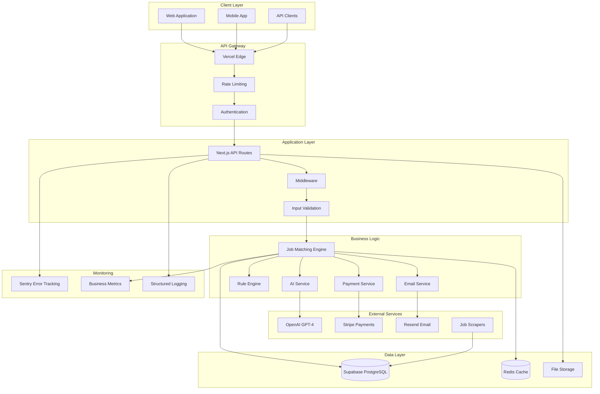
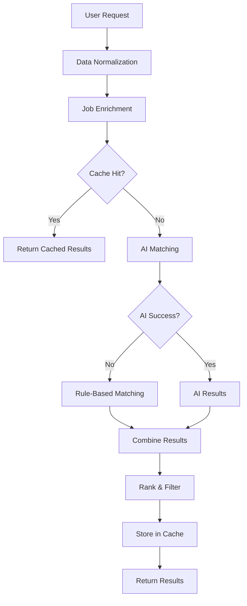
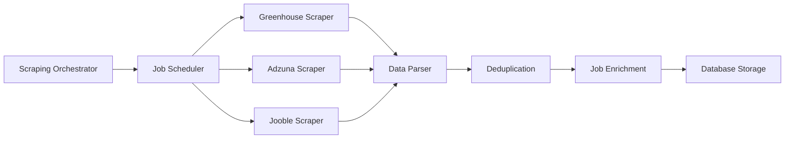

# JobPing System Architecture

## Overview

JobPing is a sophisticated job matching platform designed for early-career professionals. The system combines AI-powered analysis with rule-based filtering to provide highly accurate job recommendations at scale.

## High-Level Architecture



## Core Components

### 1. **API Gateway (Vercel)**

**Responsibilities:**
- Request routing and load balancing
- Rate limiting and DDoS protection
- SSL termination and security headers
- Geographic distribution via edge network

**Configuration:**
- Global edge network with 100+ locations
- Automatic HTTPS with HSTS
- Security headers (CSP, X-Frame-Options, etc.)
- Request/response compression

### 2. **Application Layer (Next.js)**

**Architecture Pattern:** Serverless Functions with Edge Runtime

**Key Features:**
- Type-safe API routes with TypeScript
- Automatic request/response validation
- Built-in middleware support
- Hot reloading in development

**API Routes:**
```
/api/
 health/                 # System health check
 match-users/           # Core matching endpoint
 send-scheduled-emails/ # Email automation
 signup/                # User registration (signup form)
 dashboard/             # Analytics dashboard
 user-matches/          # User match retrieval
 create-checkout-session/ # Payment processing
 webhooks/stripe/       # Payment webhooks
 scrape/               # Job scraping endpoints
```

### 3. **Job Matching Engine**

**Architecture:** Multi-layered matching system with intelligent fallback



**Components:**

#### **ConsolidatedMatchingEngine**
- Main orchestrator for all matching logic
- Intelligent fallback from AI to rule-based
- Performance optimization with caching
- Comprehensive error handling

#### **AIMatchingService**
- GPT-4 Turbo integration
- Sophisticated prompt engineering
- LRU caching with TTL
- Cost optimization strategies

#### **RuleBasedMatcher**
- Multi-dimensional scoring system
- Hard gate filtering
- Configurable rule sets
- High-performance fallback

#### **JobEnrichmentService**
- Metadata extraction and enhancement
- Market demand analysis
- Company profile enrichment
- Skill alignment scoring

### 4. **Data Architecture**

#### **Primary Database (Supabase PostgreSQL)**

**Schema Design:**
```sql
-- Core Tables
users (id, email, preferences, created_at, updated_at)
jobs (id, title, company, location, description, categories, posted_at)
matches (id, user_email, job_hash, match_score, match_reason, created_at)

-- Supporting Tables
subscriptions (id, user_id, status, amount, created_at)
user_feedback (id, user_email, rating, feedback, created_at)
analytics_events (id, event_type, user_id, data, created_at)
```

**Indexing Strategy:**
```sql
-- Performance Indexes
CREATE INDEX idx_jobs_categories ON jobs USING GIN(categories);
CREATE INDEX idx_jobs_posted_at ON jobs(posted_at DESC);
CREATE INDEX idx_matches_user_email ON matches(user_email);
CREATE INDEX idx_matches_created_at ON matches(created_at DESC);

-- Composite Indexes
CREATE INDEX idx_jobs_location_categories ON jobs(location, categories);
CREATE INDEX idx_matches_user_created ON matches(user_email, created_at);
```

#### **Caching Layer (Redis)**

**Cache Strategy:**
- **AI Results**: 30-minute TTL with LRU eviction
- **User Preferences**: 1-hour TTL
- **Job Data**: 15-minute TTL
- **Rate Limiting**: Sliding window counters

**Cache Keys:**
```
ai_match:{user_hash}:{job_hash}     # AI matching results
user_prefs:{user_email}             # User preferences
job_data:{job_hash}                 # Enriched job data
rate_limit:{endpoint}:{identifier}  # Rate limiting
```

### 5. **External Service Integration**

#### **OpenAI Integration**
- **Model**: GPT-4 Turbo for optimal performance/cost ratio
- **Rate Limiting**: 3 requests per minute with exponential backoff
- **Error Handling**: Automatic fallback to rule-based matching
- **Cost Optimization**: Smart prompt engineering and caching

#### **Stripe Payment Processing**
- **Webhook Security**: Signature verification and idempotency
- **Subscription Management**: Automated billing and renewals
- **Error Handling**: Comprehensive retry logic and user notifications

#### **Email Service (Resend)**
- **Template System**: Dynamic email templates with personalization
- **Delivery Tracking**: Open rates and click tracking
- **Bounce Handling**: Automatic list management and retry logic

### 6. **Job Scraping System**

**Architecture:** Distributed scraping with intelligent scheduling



**Key Features:**
- **Rate Limiting**: Respectful scraping with delays
- **Deduplication**: Hash-based job deduplication
- **Error Recovery**: Automatic retry with exponential backoff
- **Data Quality**: Validation and normalization

## Security Architecture

### 1. **Authentication & Authorization**

**JWT-Based Authentication:**
- Secure token generation with RS256
- Token expiration and refresh mechanisms
- Role-based access control (User, Admin, System)

**API Key Authentication:**
- System-level API keys for automation
- Admin API keys for management operations
- Key rotation and monitoring

### 2. **Data Protection**

**Encryption:**
- Data at rest: AES-256 encryption
- Data in transit: TLS 1.3
- Sensitive data: Field-level encryption

**Privacy Compliance:**
- GDPR compliance with data portability
- User data deletion and anonymization
- Consent management and audit trails

### 3. **Security Headers**

```typescript
// Comprehensive security headers
{
  'Strict-Transport-Security': 'max-age=31536000; includeSubDomains; preload',
  'Content-Security-Policy': "default-src 'self'; script-src 'self' 'unsafe-inline'...",
  'X-Frame-Options': 'DENY',
  'X-Content-Type-Options': 'nosniff',
  'X-XSS-Protection': '1; mode=block',
  'Referrer-Policy': 'strict-origin-when-cross-origin',
  'Permissions-Policy': 'camera=(), microphone=(), geolocation=()'
}
```

## Performance Architecture

### 1. **Caching Strategy**

**Multi-Level Caching:**
- **Edge Caching**: Vercel Edge Network (global)
- **Application Caching**: Redis (in-memory)
- **Database Caching**: PostgreSQL query cache
- **CDN Caching**: Static assets and API responses

### 2. **Database Optimization**

**Query Optimization:**
- Prepared statements and parameterized queries
- Efficient indexing strategy
- Query plan analysis and optimization
- Connection pooling with PgBouncer

**Read Replicas:**
- Master-slave replication for read scaling
- Automatic failover and load balancing
- Geographic distribution for low latency

### 3. **API Performance**

**Response Time Targets:**
- Health checks: < 100ms
- User matches: < 2 seconds
- Job matching: < 5 seconds
- Email sending: < 10 seconds

**Optimization Techniques:**
- Parallel processing with Promise.all
- Database query optimization
- Intelligent caching strategies
- Request deduplication

## Monitoring & Observability

### 1. **Error Tracking (Sentry)**

**Error Categories:**
- **Critical**: System failures, data corruption
- **High**: API errors, external service failures
- **Medium**: Validation errors, rate limiting
- **Low**: User input errors, warnings

**Error Context:**
- User ID and session information
- Request parameters and headers
- Stack traces and error chains
- Performance metrics and timing

### 2. **Business Metrics**

**Key Performance Indicators:**
- User acquisition and retention rates
- Job matching success rates
- Revenue and conversion metrics
- System performance and reliability

**Real-time Monitoring:**
- Dashboard with live metrics
- Automated alerting for critical thresholds
- Trend analysis and forecasting
- Cost tracking and optimization

### 3. **Logging Strategy**

**Structured Logging:**
```json
{
  "timestamp": "2024-01-15T10:30:00Z",
  "level": "info",
  "service": "job-matching",
  "operation": "ai_matching",
  "userId": "user_123",
  "duration": 2340,
  "success": true,
  "metadata": {
    "jobCount": 150,
    "matchCount": 12,
    "cacheHit": false
  }
}
```

## Scalability Architecture

### 1. **Horizontal Scaling**

**Serverless Functions:**
- Automatic scaling based on demand
- No server management required
- Pay-per-use pricing model
- Global edge distribution

**Database Scaling:**
- Read replicas for query distribution
- Connection pooling for efficiency
- Partitioning for large datasets
- Caching for performance

### 2. **Load Handling**

**Current Capacity:**
- 1,000+ concurrent users
- 10,000+ API requests per minute
- 100,000+ jobs in database
- 50,000+ matches per day

**Scaling Targets:**
- 10,000+ concurrent users
- 100,000+ API requests per minute
- 1,000,000+ jobs in database
- 500,000+ matches per day

### 3. **Cost Optimization**

**Resource Management:**
- Intelligent caching to reduce API calls
- Efficient database queries
- Optimized AI prompt engineering
- Automated scaling and resource allocation

## Deployment Architecture

### 1. **Environment Strategy**

**Environments:**
- **Development**: Local development with hot reloading
- **Staging**: Production-like environment for testing
- **Production**: Live environment with monitoring

**Deployment Pipeline:**


### 2. **Infrastructure as Code**

**Vercel Configuration:**
- Automatic deployments from Git
- Environment variable management
- Custom domain configuration
- SSL certificate management

**Database Management:**
- Supabase dashboard for administration
- Automated backups and point-in-time recovery
- Schema migrations and version control
- Performance monitoring and optimization

## Disaster Recovery

### 1. **Backup Strategy**

**Database Backups:**
- Daily automated backups
- Point-in-time recovery capability
- Cross-region backup replication
- Backup testing and validation

**Code and Configuration:**
- Git repository with full history
- Environment configuration backup
- Infrastructure state documentation
- Recovery procedures documentation

### 2. **Failover Procedures**

**Service Failover:**
- Automatic failover for database replicas
- Manual failover procedures for critical services
- Health check monitoring and alerting
- Recovery time objectives (RTO) and recovery point objectives (RPO)

## Future Architecture Considerations

### 1. **Microservices Migration**

**Potential Services:**
- User Management Service
- Job Matching Service
- Email Service
- Payment Service
- Analytics Service

**Migration Strategy:**
- Gradual service extraction
- API gateway for service communication
- Event-driven architecture
- Service mesh for observability

### 2. **Advanced AI Integration**

**Machine Learning Pipeline:**
- Custom ML models for job matching
- Real-time learning from user feedback
- A/B testing framework for model comparison
- Feature engineering and model training

### 3. **Global Expansion**

**Multi-Region Deployment:**
- Geographic distribution of services
- Data residency compliance
- Latency optimization
- Disaster recovery across regions

## Production Architecture (2025)

The system has been unified for production readiness with consistent patterns:

### Unified Patterns
- **Error Handling**: Single `AppError` → `ErrorHandler` → Sentry pipeline
- **API Routes**: `createUnifiedHandler()` with rate limiting, validation, and monitoring
- **Database Access**: Enhanced `Utils/supabase.ts` with retry logic and timeouts
- **Configuration**: Centralized `Utils/config/runtime.ts` for all settings
- **Monitoring**: Enhanced monitoring with Sentry integration and metrics collection

### Production Features
- **LRU Cache**: Efficient memory management with automatic cleanup
- **Circuit Breaker**: Automatic failure detection and recovery for AI services
- **Retry Logic**: Exponential backoff for transient failures
- **Health Checks**: Comprehensive system health monitoring
- **Metrics**: Lightweight metrics collection with dashboard data
- **Rate Limiting**: Configurable per-endpoint limits with cleanup

### File Structure
```
Utils/
├── api/unified-api-handler.ts     # Single API handler for all routes
├── config/runtime.ts              # Centralized configuration
├── monitoring/enhanced-monitoring.ts # Sentry + metrics integration
├── supabase.ts                    # Enhanced database access
└── consolidatedMatching.ts        # Production-ready matching engine
```

## Conclusion

JobPing's architecture is designed for scalability, reliability, and performance. The system leverages modern serverless technologies, intelligent caching, and AI-powered matching to deliver a superior user experience while maintaining cost efficiency and operational simplicity.

The unified architecture ensures consistent patterns across all components, making the system easier to maintain, debug, and scale. The comprehensive monitoring and error handling ensure system reliability and quick issue resolution.
